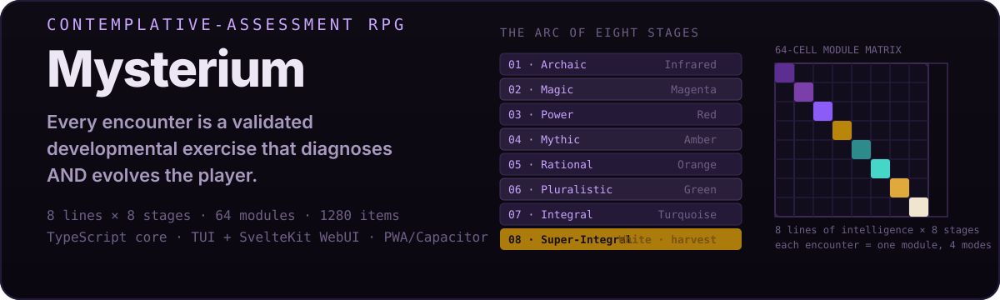

# Mysterium

<!-- T2I HERO SPEC — Subject: a contemplative-assessment RPG — a lone figure on a spiraling path ascending through eight color-stages (Infrared → Magenta → Red → Amber → Orange → Green → Turquoise → White), with a 64-cell matrix grid faintly visible as the world beneath. Composition: vertical ascent, spiral path, vignette glow at the summit. Palette: stage colors flowing dark infrared → luminous white; deep charcoal #0f0f14 background, gold accent. Style: painterly game key-art, soft volumetric light, no text. 16:9. -->

<p align="center">
  
</p>

<p align="center">
  <a href="https://github.com/ishan-parihar/mysterium"></a>

  
  
  
</p>

> 🎮 **Status: Functionally operational.** Core architecture complete.
> Full 64-cell developmental assessment (8 lines × 8 stages, 1,280
> items), TUI (globally-installable `mysterium` CLI), and SvelteKit WebUI
> are all built and runnable end-to-end. First vertical slice (Red
> stage) ready for internal playtesting.

A contemplative-assessment RPG whose every encounter is the
gamification of a validated developmental assessment, whose
macro-progression is the eight stages of consciousness (64-cell module
architecture), and whose endgame is the harvest into 4th-density unity
in the canonical Law-of-One framing. Built personally. Designed to be
globally deployable. Adaptive to any age, any developmental altitude.

The vision is documented in [`docs/00-vision.md`](./docs/00-vision.md).
The build-plan history is in [`docs/CHANGELOG.md`](./docs/CHANGELOG.md)
and the eight-stage research foundation is in
[`docs/INDEX.md`](./docs/INDEX.md).

---

## What this is

Mysterium is **two things at once**:

1. An **assessment-module-driven developmental RPG** with narrative
   arcs, immersive gameplay, and a 64-cell module architecture (8
   lines of intelligence × 8 stages of consciousness). Every
   encounter is a module executing in one of four modes
   (calibration, encounter, practice, shadow work).
2. A **literal cognitive / developmental practice** — every assessment
   module is a validated developmental exercise that simultaneously
   diagnoses AND heals / evolves the player. The game's progression
   IS the demonstration of integrated growth across all eight lines
   of intelligence.

There are **two ways to play it**:

| Surface | What it is | What you run |
|---|---|---|
| **TUI (CLI)** | Headless text-mode engine. The complete game loop in your terminal. LLM-driven reflective prose. World-building dialogue in ink. | `mysterium` |
| **WebUI** | SvelteKit Single-Page Application. The same engine, served as a browser app (PWA installable, mobile-capable, Capacitor-buildable to Android). | `npm run dev` or visit the deployed URL |

Both surfaces share the same `src/core/` engine, same registries, same
64 modules, same 1,280 assessment items. There is one game.

## How it compares

| Dimension | **Mysterium** | MBTI / Big Five tests | Enneagram | Spiral Dynamics (theory) |
|---|---|---|---|---|
| **Type** | Playable RPG — assessment *is* the game | Static questionnaire | Static questionnaire | Academic framework, no product |
| **Coverage** | 64 cells = 8 lines × 8 stages, 1,280 items | 1 dimension per test | 9 types | Stages only, no line matrix |
| **Trajectory** | Tracks *development over time* across stages | Snapshots a type | Snapshots a type | Descriptive stages |
| **Intervention** | Modules *diagnose and heal* (calibration/encounter/practice/shadow-work) | Report only | Report only | None |
| **Engine** | Deterministic TS core, TUI + WebUI, same data | Usually static | Usually static | Paper |

MBTI answers *what you are today*; Mysterium plays *how you grow* — and
it does so with a formal 8×8 matrix verified in `src/core/domain/Stage.ts`
(8 stages) and `src/core/domain/Line.ts` (8 lines), every cell backed by
assessment items the player actually works through.

---

## Quick install & run

### TUI (CLI) — global install

The CLI bundles to a single ESM file and registers as the `mysterium`
executable on your `PATH`. Once installed, you can launch the game
from any directory.

```bash
# 1. Clone the repo
git clone https://github.com/ishan-parihar/mysterium.git
cd Mysterium

# 2. Install dependencies (build-time only)
npm install

# 3. Install Mysterium globally on your PATH
npm install -g .

# 4. Run it from anywhere
mysterium                  # interactive session
mysterium --help           # all flags + subcommands
mysterium diagnostic       # exercise registries + scheduler without starting a session
mysterium glossary         # definitions of Mysterium terms
mysterium status           # current save state
mysterium profile list     # manage user profiles
mysterium setup            # configure LLM provider + preferences
```

The CLI binary lives at `dist/cli/cli-game.js` (regenerated by
`npm run build:cli`). The global symlink lives at
`~/.npm-global/bin/mysterium` (or wherever your `npm prefix -g` resolves).

#### LLM configuration

The CLI's reflective prose requires an LLM provider. Pick one:

```bash
# Option A: pre-built shortcuts (any of these work)
export OPENAI_API_KEY=sk-...
export ANTHROPIC_API_KEY=sk-ant-...
# or interactive wizard:
mysterium setup

# Option B: generic, provider-agnostic
export LLM_PROVIDER=openai   # or anthropic
export LLM_BASE_URL=https://api.openai.com/v1
export LLM_API_KEY=sk-...
export LLM_MODEL=gpt-4o-mini
```

Without an LLM, `mysterium diagnostic`, `mysterium glossary`, `mysterium status`,
and `mysterium profile *` still work — they exercise the module
registry, scheduler, holons, and persistence layer end-to-end.

#### Headless / scripted mode

For CI smoke-tests, AI-agent feedback loops, or unattended study
sessions:

```bash
# Headless, 20 encounters, JSON output for downstream parsing
mysterium --headless --encounters=20 --json

# Read answers from a file (one per question, consumed top-to-bottom)
mysterium --headless --encounters=5 --answers ./my-answers.txt

# Inline answer (repeatable — one per question)
mysterium --headless --encounters=1 --answer "yes" --answer "no"

# Single-encounter smoke test (used in CI; non-LLM mode)
mysterium --headless --encounters=1 --no-llm

# Read prompts + state without any LLM dependency
mysterium diagnostic
```

#### Undo a global install

```bash
npm uninstall -g mysterium
```

---

### WebUI — local dev server + production build

The WebUI is a SvelteKit 2 + Svelte 5 (runes) app. It runs in two
target modes:

| Build target | Adapter | Where it deploys |
|---|---|---|
| `BUILD_TARGET=cloudflare` (default) | `@sveltejs/adapter-cloudflare` | Cloudflare Pages (SSR + BFF endpoints + Workers KV/Analytics) |
| `BUILD_TARGET=static` | `@sveltejs/adapter-static` | Capacitor (Android / iOS), GitHub Pages, any static host |

#### Local development

```bash
npm install
npm run dev          # Vite dev server with HMR  →  http://localhost:5173
npm run check        # svelte-check (types + a11y warnings)
npm run typecheck    # tsc --noEmit
npm run test         # vitest unit tests
```

Open <http://localhost:5173>. On first visit you'll land on
`/onboarding` (binary-search composite assessment); once a
Significator exists, `/` is the main hub.

#### Production build

```bash
# Cloudflare target (default) — full SSR + BFF endpoints
npm run build

# Static target — pure SPA, no SSR, no server endpoints
BUILD_TARGET=static npm run build

# Bundle only the CLI (independent of the WebUI)
npm run build:cli

# Preview the production build locally
npm run preview      # →  http://localhost:4173
```

The full `npm run build` runs four gates in order — and **any failure
stops the build**:

1. `npm run check:invariants` — domain-layer invariant checks (the
   architectural guard rails).
2. `svelte-kit sync` — regenerates `.svelte-kit/`.
3. `tsc --noEmit` — full type-check.
4. `vite build` — production bundle.

#### Capacitor / Android targets

```bash
npm run cap:sync        # build + cap sync
npm run cap:android     # build, sync, open Android Studio
```

#### Deployment

For Cloudflare Pages production deploy:

```bash
npm run build
npx wrangler pages deploy .svelte-kit/output/cloudflare
```

Set the `LLM_API_KEY` (or `OPENAI_API_KEY` / `ANTHROPIC_API_KEY`)
secret in your Cloudflare Pages project before deploying. Cloudflare
KV namespaces (`SAVE_KV`, `RECOVERY_KV`) and Analytics Engine
(`ANALYTICS`) bindings are declared in `wrangler.toml`.

For static / Capacitor / GitHub-Pages deploy:

```bash
BUILD_TARGET=static npm run build
# Output is in .svelte-kit/output/client/ — upload the contents,
# or `npx cap sync` to ship to native shells.
```

#### WebUI WebUI API surface (BFF)

The web shell talks to a Backend-For-Frontend layer (`/api/*`) that
keeps the LLM API key server-side:

| Endpoint | Purpose |
|---|---|
| `POST /api/save` | Persist encrypted save blob to Workers KV |
| `POST /api/recovery/generate` | Generate a 12-word mnemonic |
| `POST /api/recovery/restore` | Restore save from mnemonic |
| `POST /api/telemetry` | Ingest analytics events |
| `POST /api/llm/chat` | Single LLM completion (provider-agnostic) |
| `POST /api/llm/tools` | Tool-using LLM completion (agent path) |

Under static build (`BUILD_TARGET=static`) these endpoints are
unreachable; the client falls back to local persistence + direct
browser-side LLM calls (dev-only).

---

## Routing map (WebUI)

| Route | Purpose |
|---|---|
| `/` | Main hub. Redirects to `/onboarding` if no Significator exists; otherwise a hub card showing the day's route. |
| `/onboarding` | Binary-search composite assessment that locates the player's first-stage altitude across all 8 lines. |
| `/play` | The gameplay engine: world, encounter, reflection. Drives the full developmental loop in the browser. |
| `/profile` | Developmental profile with an 8-line radar. Reads from the Significator with full Veil filtering. |
| `/profiles` | Multi-profile management. Switch, create, delete user profiles. |
| `/journal` | Codex entries + vows the player has earned. |
| `/codex` | The unlocked knowledge — entries revealed as the player attains thresholds. |
| `/glossary` | Definitions of Mysterium terminology (3 essentials + unlocked terms; `--full` requires dev mode). |
| `/diagnostic` | A read-only view of the engine state — registries, holons, scheduler output, Significator. For inspection & debugging. |
| `/settings` | Accessibility, privacy, reset. |
| `/recover` | Save recovery via 12-word mnemonic. |
| `/telemetry` | Telemetry transparency. |
| `/setup` | First-run LLM provider configuration. |
| `/api/*` | BFF endpoints (Cloudflare adapter only). |

---

## The four canon decisions

| # | Decision |
|:-:|---|
| 1 | **Law-of-One layer = canon, fully integrated.** Seven energy rays as first-class types; harvest into 4th density as canonical endgame. |
| 2 | **No clinical / IRB ambition.** Commitment to *legitimate* neurological / biological / psychological efficacy via validated tasks and honest telemetry — without regulated medical-device certification. |
| 3 | **Adaptive onboarding for any age, any altitude.** Built personally, deployed globally. |
| 4 | **MVP = modular foundation of everything.** All 8 lines, 8 stages, 7 rays, 4 quadrants registered as modules at MVP launch. Red stage as the first vertical slice. Adding the rest is content drops. |

---

## Repository layout (current)

<details><summary>Full repository tree</summary>

```
Mysterium/
├── README.md                              <- you are here
├── AGENTS.md                              <- agent/iteration protocol
│
├── package.json
├── svelte.config.js                       <- dual-target: cloudflare | static
├── vite.config.ts
├── tsup.config.ts                         <- CLI bundle config
├── install.sh                             <- one-shot installer (legacy path)
├── wrangler.toml                          <- Cloudflare Workers config
├── capacitor.config.json                  <- native-shell config
│
├── docs/                                  <- the research foundation
│   ├── INDEX.md                           <- navigation
│   ├── REQUIREMENTS.md                    <- document-of-documents
│   ├── CHANGELOG.md                       <- canon-decision history
│   ├── STAGE-ASSESSMENT-ARCHITECTURE.md   <- module contract & execution modes
│   ├── ONBOARDING-REDESIGN-PLAN.md        <- binary-search composite assessment
│   ├── 00-vision.md
│   ├── 01-first-principles.md
│   ├── 02-glossary.md
│   ├── 03-research-methodology.md
│   ├── foundations/                       <- 28 theoretical foundations
│   ├── lines/                             <- 8 lines of intelligence
│   ├── stages/                            <- 8 stages of consciousness
│   ├── progression/                       <- progression overview
│   ├── narrative/                         <- narrative architecture
│   ├── concept-drafts/                    <- 512 game concept documents
│   ├── audits/                            <- capability / red-team audits
│   ├── archive/                           <- obsolete docs
│   ├── root-archive/                      <- doc-relocation history
│   └── superpowers/                       <- agent capability notes
│
├── scripts/                               <- runnable build/dev helpers
│   ├── cli-game.ts                        <- the 221 KB CLI runner (entry)
│   ├── check-invariants.ts                <- architectural guard rails
│   ├── tdg-probe.ts                       <- TDG diagnostic probe
│   ├── build-concept-index.ts             <- regenerates concept index
│   ├── regression-sweep.sh                <- CI regression sweep
│   └── *.py                               <- module-spec rebuild helpers
│
├── src/
│   ├── app.html                           <- SvelteKit shell
│   ├── app.d.ts
│   ├── hooks.client.ts / hooks.server.ts  <- runtime hooks
│   │
│   ├── routes/                            <- SvelteKit pages + API endpoints
│   │   ├── +layout.svelte / +page.svelte  <- shell + main hub
│   │   ├── onboarding/ play/ profile/
│   │   ├── profiles/ journal/ codex/
│   │   ├── glossary/ diagnostic/ settings/
│   │   ├── recover/ telemetry/ setup/
│   │   └── api/                           <- BFF endpoints
│   │
│   ├── lib/                               <- Svelte UI primitives + state
│   │   ├── components/                    <- Svelte 5 components
│   │   ├── stores/                        <- gameStore, accessibilityStore, ...
│   │   ├── engine/                        <- WebUI-side engine glue
│   │   ├── capabilities/                  <- browser capability detection
│   │   └── transitions/                   <- motion primitives
│   │
│   ├── core/                              <- pure TS domain layer — no Phaser,
│   │   │                                     no native, no network; runs in
│   │   │                                     Node, in tests, in the browser.
│   │   ├── domain/                        <- core types (Significator, Line, ...)
│   │   ├── registries/                    <- 8 singleton registries
│   │   ├── assessments/                   <- module registry, AgentOrchestrator
│   │   ├── engines/                       <- CCIEngine, Scheduler, ...
│   │   ├── logic/                         <- container helpers
│   │   ├── presentation/                  <- veilDescriptors (Veil layer)
│   │   ├── agent/                         <- PersistentAgent, ToolRegistry
│   │   ├── telemetry/                     <- telemetry event types
│   │   ├── accessibility/                 <- a11y layer
│   │   ├── events/                        <- event-bus core
│   │   ├── usecases/                      <- higher-level use cases
│   │   ├── data/                          <- canonical JSON registries
│   │   └── GameLoop.ts                    <- session lifecycle entry
│   │
│   ├── infra/                             <- I/O adapters (LLM, persistence,
│   │                                         telemetry pipeline, veil filters)
│   ├── cli/                               <- tiny TUI-side helpers
│   ├── shared/                            <- shared types + constants
│   └── styles/                            <- global CSS
│
├── tests/                                 <- Vitest specs
├── dist/cli/                              <- bundled CLI artifacts
├── .svelte-kit/output/                    <- SvelteKit build output
│
├── static/                                <- bundled assets└── public/                             <- reserved
```

</details>


---

## Status

| Layer | Status |
|---|---|
| Research / design documentation | ✅ Complete — 28 foundations + concept-drafts, canon-locked. |
| Concept-drafts (512 modules) | ✅ Complete — all 512 concept-drafts exist. |
| Implementation Phase 0: Legacy Removal | ✅ Complete — ATB removed, Significator is sole state vessel. |
| Implementation Phase 1: Core Architecture | ✅ Complete — Assessment engine, CCI, AutoMode, Scheduler, all 64 modules with 1,280 items. |
| Implementation Phase 2: First Playable | ✅ Complete — Full developmental loop, encounter selection UI, checkpoint system, accessibility layer. |
| Implementation Phase 3: Polish | ✅ Complete — Macro-catalyst engine, WorldState enrichment, transformation lifecycle. |
| TUI (CLI) | ✅ Operationally validated — 64 modules load, scheduler produces encounters, LLM reflection path live (config required). |
| WebUI (SvelteKit) | ✅ Operationally validated — production build passes all four gates; dev server live on `:5173`. |
| Cloudflare deploy | ⏳ Pending — `wrangler pages deploy` ready; requires `LLM_API_KEY` secret + KV namespaces provisioned. |
| Android (Capacitor) | ⏳ Buildable — `npm run cap:android` opens Android Studio when an Android target is configured. |

---

## Architecture in one paragraph

The codebase is split into three layers:

- `src/core/` — **pure TypeScript, zero I/O.** No Phaser, no native,
  no network — runs in Node, in tests, in the browser, in any TS
  engine. The game is fully deterministic given the same inputs and
  registry state.
- `src/infra/` — **I/O adapters.** LLM clients (`LLMClient.ts`,
  `ProviderRegistry.ts`), persistence (cloud + local), telemetry
  pipelines, locale, and the Veil filter.
- `src/{routes,lib,cli}/` — **surfaces.** The WebUI renders Svelte 5
  components over the core; the CLI concatenates a terminal-friendly
  dialogue layer over the same core.

The MVP introduces **eight registries** (`LineRegistry`,
`StageRegistry`, `RayRegistry`, `TaskRegistry`, `AbilityRegistry`,
`EncounterRegistry`, `DriveRegistry`, `NarrativeRegistry`) so that
adding a new stage, line, ray, task, ability, encounter, drive, or
narrative beat is a *data-and-adapter change*, never a rewrite.

---

## The eight-stage developmental arc at a glance

| # | Stage | Energy ray | Defining capacity |
|:-:|---|---|---|
| 1 | Infrared / Archaic | Red | Survival, sensori-motor |
| 2 | Magenta / Magic | Orange | Symbol, magical agency |
| 3 | Red / Power | Yellow | Ego, will, dominance |
| 4 | Amber / Mythic | Green | Belonging, rule-and-role |
| 5 | Orange / Rational | Blue (in) | Reason, achievement |
| 6 | Green / Pluralistic | Blue (out) | Sensitivity, plurality |
| 7 | Turquoise / Integral | Indigo | Vision-logic, holism |
| 8 | White / Super-Integral | Violet | Non-dual, harvest |

Per-stage world bibles are in [`docs/stages/`](./docs/stages/).

---

## The eight lines of intelligence

| Line | Quadrant home | Assessment style |
|---|---|---|
| Cognitive | UR | Planning, working-memory, Tower-of-London |
| Emotional | UL | Empathy reads, affect-regulation, mood recognition |
| Moral | UL→LL | Choice-based dilemmas, value-priority assessments |
| Intrapersonal | UL | Witness pause, self-tag, integrate |
| Spiritual | UL | State-shifting, value-priority modules |
| Somatic | UR | Rhythm, proprioception, breath-gated abilities |
| Willpower | UL→UR | Goal-locking, fatigue resistance |
| Interpersonal | LL | Co-op synergies, conflict resolution |

Per-line documents are in [`docs/lines/`](./docs/lines/).

---

## Reading the documentation

For the thirty-minute version:

1. [`docs/00-vision.md`](./docs/00-vision.md)
2. [`docs/01-first-principles.md`](./docs/01-first-principles.md)
3. [`docs/CHANGELOG.md`](./docs/CHANGELOG.md)

For a deeper tour (the architecture), add:

4. [`docs/INDEX.md`](./docs/INDEX.md)
5. [`docs/foundations/00-integral-theory.md`](./docs/foundations/00-integral-theory.md)
6. [`docs/foundations/06-law-of-one-correspondence.md`](./docs/foundations/06-law-of-one-correspondence.md)
7. [`docs/STAGE-ASSESSMENT-ARCHITECTURE.md`](./docs/STAGE-ASSESSMENT-ARCHITECTURE.md)

If you want **all of it**, follow the reading order in
[`docs/INDEX.md`](./docs/INDEX.md).

---

## Contributing

This project is **personally authored** by
[@ishan-parihar](https://github.com/ishan-parihar) and shipped
globally. External contributions of the cognitive content (cultural
reviewers for affect-recognition stimuli, linguistic localisation of
narration, accessibility expertise) are welcomed once the MVP is
stable. Until then, please open Issues for discussion. PRs against
the early scaffold are accepted at the maintainer's discretion.

A `CONTRIBUTING.md` will be added during Phase 5.

---

## License

MIT — see [`LICENSE`](LICENSE). The architectural blueprint (now
archived) and the entire `docs/` tree are provided as-is for study and
reference.

---

## Acknowledgements

- **Ken Wilber** — Integral / AQAL theory; the eight-stage
  developmental framework.
- **The Ra material** (L/L Research) — the seven-ray cosmology
  canonised into Mysterium's metaphysics.
- **Adele Diamond, Akira Miyake, Naomi Friedman** — the
  executive-functions taxonomy Mysterium's combat verbs are
  gamifications of.
- **Mihaly Csikszentmihalyi** — the flow-channel theory underpinning
  the staircase difficulty system.
- **Jean Piaget, Lawrence Kohlberg, James Fowler, Jane Loevinger,
  Susanne Cook-Greuter, Robert Kegan** — the developmental-stages
  research synthesised into the eight-stage canon.
- **Phaser**, **Svelte / SvelteKit**, **TypeScript**, **Vite**,
  **Tsup**, **Capacitor**, **Vitest**, **Wrangler / Cloudflare** —
  the technical foundation.

The full bibliography will live in `docs/validation/BIBLIOGRAPHY.md`
during Phase 5.

---

*"Reality is not constructed; it is unfolded from a pre-existing whole."*


## Quick Start

### TUI (CLI)

```bash
# Install globally
npm install -g mysterium

# Start a new character
mysterium new --name "Seeker"

# Run the Red stage (first vertical slice)
mysterium play --stage red

# Review assessment results
mysterium review --character "Seeker"
```

### Web UI (SvelteKit)

```bash
cd web-ui
npm install
npm run dev
# Open http://localhost:5173
```

### The 64-Cell Module Matrix

```
              Stage 1   Stage 2   Stage 3   Stage 4   Stage 5   Stage 6   Stage 7   Stage 8
              (Red)     (Orange)  (Yellow)  (Green)   (Blue)    (Indigo)  (Violet)  (Clear)
Line 1 (Mas)  [ ]       [ ]       [ ]       [ ]       [ ]       [ ]       [ ]       [ ]
Line 2 (Val)  [x]       [ ]       [ ]       [ ]       [ ]       [ ]       [ ]       [ ]
Line 3 (Rel)  [ ]       [ ]       [ ]       [ ]       [ ]       [ ]       [ ]       [ ]
Line 4 (Iden) [ ]       [ ]       [ ]       [ ]       [ ]       [ ]       [ ]       [ ]
Line 5 (Ego)  [ ]       [ ]       [ ]       [ ]       [ ]       [ ]       [ ]       [ ]
Line 6 (Will) [ ]       [ ]       [ ]       [ ]       [ ]       [ ]       [ ]       [ ]
Line 7 (Wis)  [ ]       [ ]       [ ]       [ ]       [ ]       [ ]       [ ]       [ ]
Line 8 (Uni)  [ ]       [ ]       [ ]       [ ]       [ ]       [ ]       [ ]       [ ]

[x] = completed    [ ] = locked    Each cell = 20 assessment items (1,280 total)
```


---

Developed by [Ishan Parihar](https://github.com/ishan-parihar) — If
you find this useful, [consider supporting](https://rzp.io/rzp/ishan-parihar).
